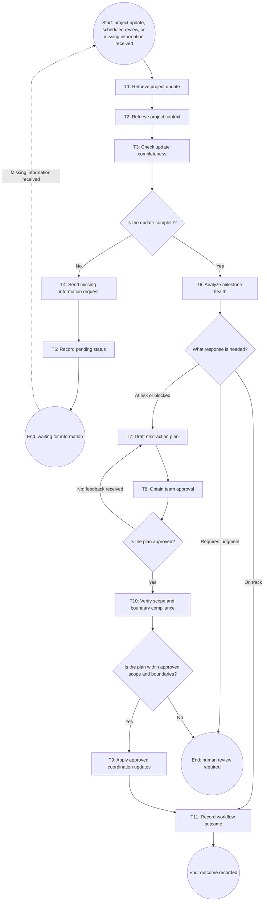

# Workflow of Tasks

## 1. Workflow Overview
### 1.1 Workflow Goal
This workflow supports the system goal defined in `my_first_agent/README.md`.

### 1.2 Workflow Trigger

The workflow begins when a team member submits a project update, HackTrack performs a scheduled milestone review, or missing information is received for a pending review.

### 1.3 Completion Condition at Runtime

The workflow is complete when the milestone status and next actions are recorded. If information is missing, HackTrack sends a request for the missing details and records the project as pending. When the missing information is received, the workflow resumes with a new run.

### 1.4 General Workflow

HackTrack receives a project update and retrieves the project board, milestone deadlines, task assignments, dependencies, and previous status records. It checks whether the update contains enough information to evaluate progress. If information is missing, HackTrack sends a request for the missing details and records the project as pending. When the missing information is received, the workflow resumes with a new run.

If the information is complete, HackTrack analyzes milestone health and classifies the project as on track, at risk, blocked, or requiring human review. If the milestone is on track, HackTrack records the outcome. If it is at risk or blocked, HackTrack drafts recommended next actions with suggested owners and deadlines. A team member reviews the plan and provides approval or feedback. If rejected, the feedback returns the plan to HackTrack for revision. If approved, HackTrack verifies that the plan is within the approved scope and boundaries before applying the coordination updates. Cases outside the approved scope are sent for human review.

### 1.5 Workflow Diagram

