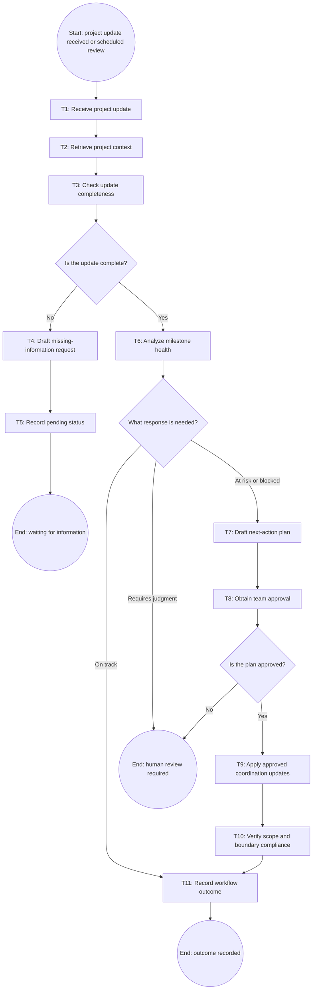

# Workflow of Tasks

*Replace all bracketed prompts with information specific to your proposed system. Delete instructional text that does not belong in your final specification. Add or remove task sections as needed. Every task shown in the general workflow must have a corresponding task specification below.*

## 1. Workflow Overview
### 1.1 Workflow Goal
This workflow supports the system goal defined in `my_first_agent/README.md`.

### 1.2 Workflow Trigger

[The workflow begins when a team member submits a project update or when HackTrack performs a scheduled milestone review.]

### 1.3 Completion Condition at Runtime

[The workflow is complete when the milestone status and next actions are recorded. If information is missing, the workflow ends with the project marked as pending. If a decision requires human judgment, it ends with a human-review request.

### 1.4 General Workflow

[HackTrack receives a project update and retrieves the project board, milestone deadlines, task assignments, dependencies, and previous status records. It checks whether the update contains enough information to evaluate progress. If information is missing, HackTrack drafts a request for the missing details and records the project as pending.
If the information is complete, HackTrack analyzes milestone health and classifies the project as on track, at risk, blocked, or requiring human review. It drafts recommended next actions with owners and deadlines. A team member must approve the proposed coordination changes before HackTrack applies them. HackTrack then verifies that the approved plan respects the project scope and system boundaries before recording the final outcome.]

### 1.5 Workflow Diagram

[Insert a flowchart showing the tasks in sequence. Label each task with a task number and short name. Show decision branches, loops, review points, and possible stopping conditions. Below is an example of a Mermaid. You can either edit the mermaid below yourself or ask ChatGPT to generate a Mermaid script based on your workflow description above. Give every task a unique ID, such as T1, T2, and T3, and name tasks using a verb and an object in the mermaid.]


```
